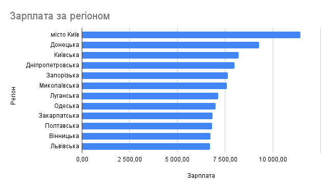
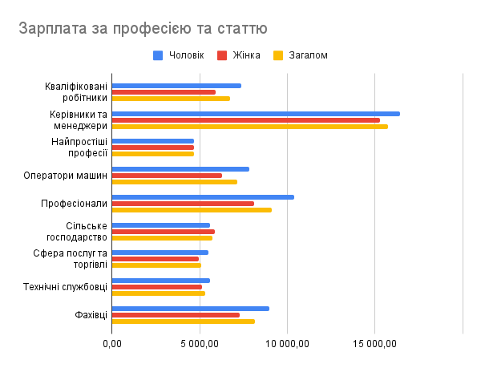
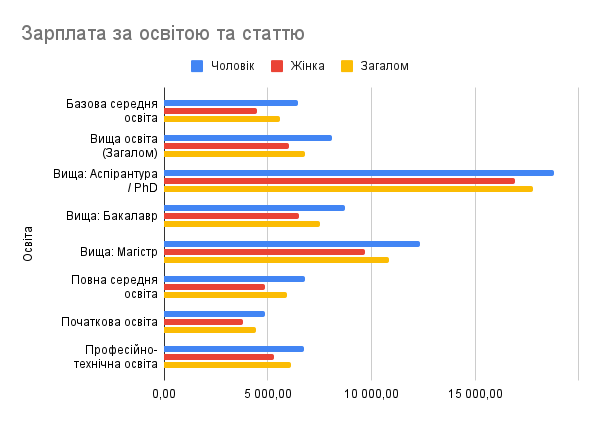
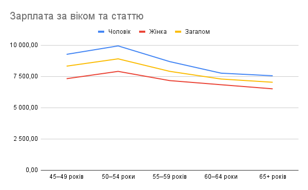
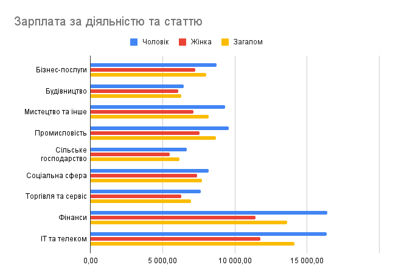
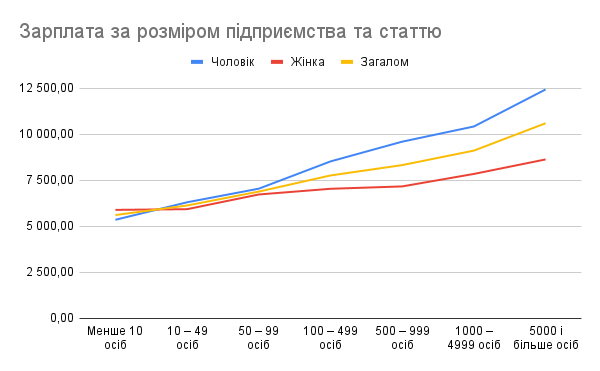
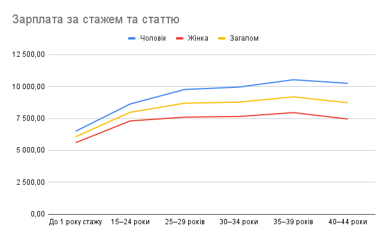

# Аналіз ринку праці та заробітних плат в Україні (2017) 📈

[cite_start]Це дослідження базується на статистичних даних щодо нарахованої заробітної плати працівників[cite: 2]. [cite_start]Метою аналізу є виявлення ключових факторів, що впливають на рівень доходу[cite: 3].

## 🛠 Методологія
[cite_start]Аналіз проводився за шістьма основними категоріями: професія, освіта, вік, тип економічної діяльності, розмір підприємства та стаж[cite: 4]. [cite_start]Для точності аналізу було вилучено агреговані технічні показники («Загалом»), щоб уникнути математичного спотворення при розрахунку середніх значень[cite: 6].

---

## 🗺 Регіональний огляд
[cite_start]Аналіз середньої заробітної плати за регіонами демонструє значну централізацію капіталу в столиці та великих промислових центрах[cite: 7, 8].

[cite_start]У 2017 році столиця та індустріальні регіони (Донецька, Дніпропетровська області) мали найвищі зарплати[cite: 9].

---

## 🔍 Аналіз за категоріями

### 1. Класифікатор професій
[cite_start]Професійна група «Керівники та менеджери» демонструє найвищий рівень доходу[cite: 12].

> **Ключовий факт:** В середньому чоловіки отримують на 17% більше за жінок. [cite_start]Найменший розрив спостерігається в «Найпростіших професіях», а у «Сільському господарстві» жінки отримують більше на 4%[cite: 13].

### 2. Вплив рівня освіти
[cite_start]Освіта залишається ключовим фактором капіталізації спеціаліста на ринку[cite: 15].

* [cite_start]**PhD/Аспірантура** є найбільш фінансово вигідним рівнем[cite: 16].
* [cite_start]Розрив між бакалавром та магістром є суттєвим, що підтверджує цінність вищої кваліфікації[cite: 16].

### 3. Вікова група та кар'єрна траєкторія

Пік заробітків припадає на вік 50–54 роки. [cite_start]Після 60 років спостерігається зниження доходів[cite: 18].

### 4. Тип економічної діяльності та підприємства
* [cite_start]**Лідери ринку:** ІТ, Телеком та Фінанси[cite: 20].
* [cite_start]**Аутсайдери:** Сільське господарство та Соціальна сфера мають найнижчі показники номінальної оплати[cite: 20].
* [cite_start]**Масштаб:** Існує пряма залежність між масштабом компанії та розміром заробітної плати[cite: 22].

### 5. Досвід роботи (Стаж)
Найшвидше зростання зарплати відбувається в перші 10 років стажу. [cite_start]Після 30 років стажу крива доходів стабілізується, а після 49 — йде донизу[cite: 24].

---

## 🚩 Висновки
[cite_start]За результатами аналізу можна виділити чотири ключові закономірності ринку праці 2017 року[cite: 26]:

1.  **Галузевий детермінізм.** Вибір сфери діяльності має більший вплив на дохід, ніж освіта чи стаж. [cite_start]Різниця між ІТ та соцсферою є критичною[cite: 27, 28].
2.  [cite_start]**Гендерний розрив.** На рівні керівної ланки розрив в оплаті сягає 17%, що вказує на бар'єри при кар'єрному просуванні жінок до топ-менеджменту[cite: 29, 30].
3.  [cite_start]**Важливість освіти.** Дані підтверджують високий ROI у вищу освіту (Магістр/PhD) порівняно з накопиченням стажу на нижчих посадах[cite: 31].
4.  [cite_start]**Стабілізація досвіду.** Продуктивний період зростання доходів триває до 15-20 років стажу, після чого зростання сповільнюється.
